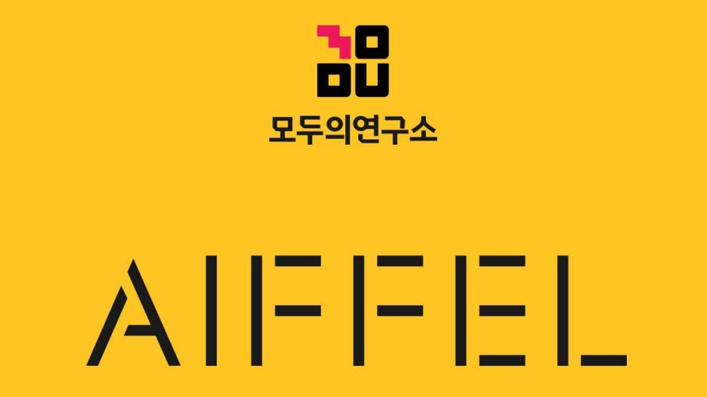

# AIFFEL AI 실습 및 프로젝트

 

* AIFFEL 부산캠퍼스에서 AI를 공부하며 배운 내용을 정리하고 프로젝트 파일을 저장하는 곳입니다.
* 기간: 2021년 12월 26일 ~ 
* 주관: 모두의연구소 AIFFEL

 

 🏆 AIFFEL Data Science, Machine Learning, Deep Learning 프로젝트 

 

### Exploration

---

|  | Contents | Description | Concept | Link |
| ----- | ----- | ----- | ----- | ----- |
| 1 | Image Classification | MNIST 손글씨 분류 | 가위바위보 분류기 | [Link]() |
| 2 | Tabular Classification| Iris의 세 가지 품종, 분류해볼 수 있겠어요?(Iris 품종 분류) | Digits, Wine, Breast cancer 분류 | [Link]() |
| 3 | Face Detection | 카메라 스티커앱 만들기 첫걸음(카메라 스티커 앱) | 고양이 수염 스티커 | [Link]() |
| 4 | Text Generation | 작사가 인공지능 만들기(Shakespeare 대사 생성) | 노래 가사 생성 | [Link]() |
| 5 |  | 나의 첫 번째 캐글 경진대회, 무작정 따라해보기 |  | [Link]() |
| 6 |  | 영화리뷰 텍스트 감성분석하기 |  | [Link]() |
| 7 |  | 인물사진을 만들어 보자 |  | [Link]() |
| 8 |  | 뉴스 요약봇 만들기 |  | [Link]() |
| 9 |  | 폐렴아 기다려라! |  | [Link]() |
| 10 |  | 인공지능으로 세상에 없던 새로운 패션 만들기 |  | [Link]() |
| 11 |  | 어제 오른 내 주식, 과연 내일은? |  | [Link]() |
| 12 |  | 트랜스포머로 만드는 대화형 챗봇 |  | [Link]() |
| 13 |  | 인간보다 퀴즈를 잘푸는 인공지능 |  | [Link]() |
| 14 |  | 아이유팬이 좋아할 만한 다른 아티스트 찾기 |  | [Link]() |
| 15 |  | 문자를 읽을 수 있는 딥러닝 |  | [Link]() |
| 16 |  | 다음에 볼 영화 예측하기 |  | [Link]() |
| 17 |  | 난 스케치를 할 테니 너는 채색을 하거라 |  | [Link]() |

### Going Deeper

---

|  | Contents | Description | Concept | Link |
| ----- | ----- | ----- | ----- | ----- |
| 1 | BackBone Network | 백본 네트워크 구조 상세분석 | VGGNet, ResNet, SENet, EfficientNet | [Link](https://github.com/museonghwang/AIFFEL/blob/master/GoingDeeper_01/%5BGD-01%5D%20Detailed%20analysis%20of%20backbone%20network%20structure.ipynb) |
| 2 | Ablation Study | Plain모델과 Residual모델 비교 분석 | VGGNet, ResNet Implement | [Link](https://github.com/museonghwang/AIFFEL/blob/master/GoingDeeper_02/%5BGD-02%5D%20Resnet%20Ablation%20Study.ipynb) |
| 3 | Augmentation | 다양한 Data Augmentation 기법 | imgaug, tf.image, albumentations | [Link](https://github.com/museonghwang/AIFFEL/blob/master/GoingDeeper_03/%5BGD-03%5D%20Augmentation%20Basic.ipynb) |
| 4 | Augmentation | 이미지 어디까지 우려볼까? | Data Augmentation, Cutmix, Mixup | [Link](https://github.com/museonghwang/AIFFEL/blob/master/GoingDeeper_04/%5BGD-04%5D%20Cutmix%20and%20Mixup%20Augmentation%20compare.ipynb) |
| 5 | Class Activation Map  | Class Activation Map 살펴보기 | XAI, CAM, Grad-CAM | [Link](https://github.com/museonghwang/AIFFEL/blob/master/GoingDeeper_05/%5BGD-05%5D%20Take%20a%20look%20at%20the%20Class%20Activation%20Map.ipynb) |
| 6 | Detection with CAM | Class Activation Map 만들기 | CAM, Grad-CAM, Bbox | [Link](https://github.com/museonghwang/AIFFEL/blob/master/GoingDeeper_06/%5BGD-06%5D%20Create%20Class%20Activation%20Map%20And%20Evaluation.ipynb) |
| 7 | Object Detection | 딥러닝 기반의 Object detection | RCNN, Fast RCNN, Faster RCNN, SSD, Yolo | [Link](https://github.com/museonghwang/AIFFEL/blob/master/GoingDeeper_07/%5BGD-07%5D%20Object%20Detection%20Concept.ipynb) |
| 8 | Object Detection | 자율주행 보조 시스템 만들기 | RetinaNet, KITTI | [Link](https://github.com/museonghwang/AIFFEL/blob/master/GoingDeeper_08/%5BGD_08%5D_Creating_an_autonomous_driving_assistance_system.ipynb) |